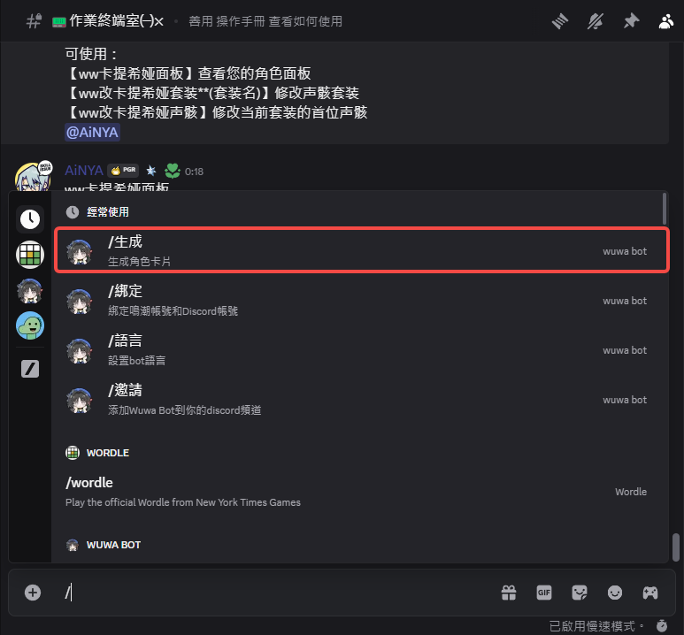
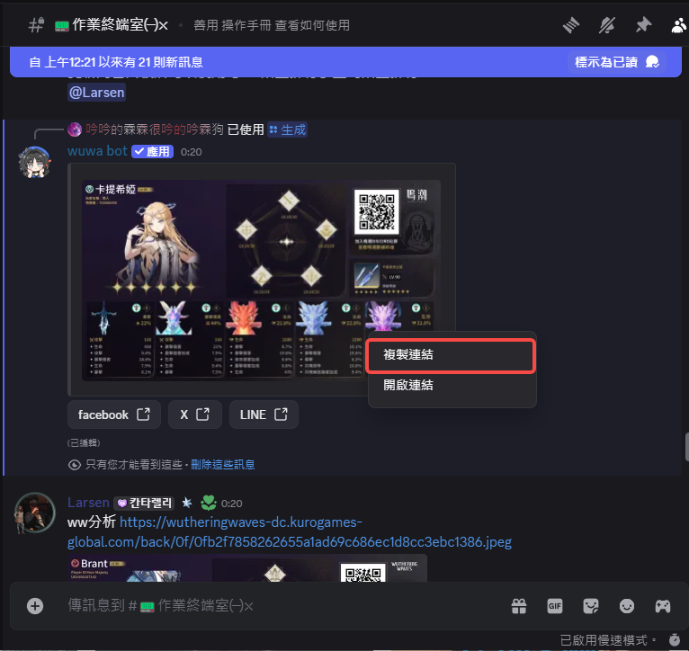
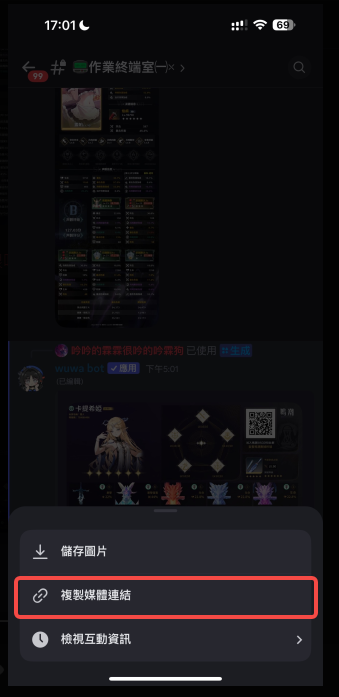
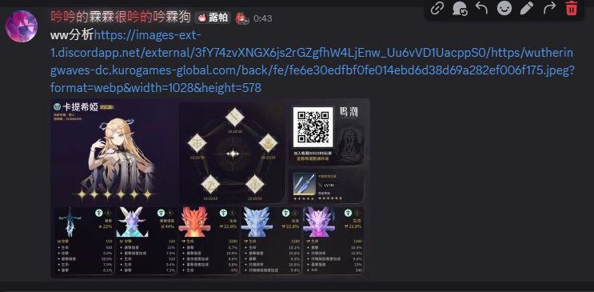

# 信息查询（一）

::: caution 前置要求
使用前务必先绑定UID和wuwabot
:::

## 一、选择终端室或您的伺服器任意频道

## 二、使用wuwabot生成基础面板（需先联动账号）
键入 / 会出现指令列表并寻找 /生成

## 三、选择您所要分析的角色
蓝色框：显示您目前该页面的角色图标（预览）
绿色框：选择您的角色
红色框：上下页按键（若找不到您的角色不妨尝试换页，可能他会在第二页唷）

## 四、复制图片链接（PC）
::: caution 
请务必不要点开图片在复制，因为DC的原理点开后会压缩图片，导致图片无法分析
:::
对图片进行右键点击复制链接

## 同上、复制图片链接（手机）
::: caution 
请务必不要点开图片在复制，因为DC的原理点开后会压缩图片，导致图片无法分析
:::
长按图片点选复制媒体链接

## 五、到任意频道中键入指令
::: info
因为目前机器人有调整过，前缀改成为 艾特机器人
:::
指令为：@艾特 分析+URL

### 正常丢指令为如下图

## 常见问题

i.若出现以下问题，请键入指令 /语言 修改为繁体中文后再生成一次

ii.若没有丢链接然而只有丢指令的花会是这样，只要一样的动作
@艾特 上传图片or链接

iii.如果你没有在时间内发送图片或跟同上一样丢图片或连接的时候没有艾特则会是这样

iv.你可能点开图片在复制了，请务必不要点开图片！！请直接复制链接

