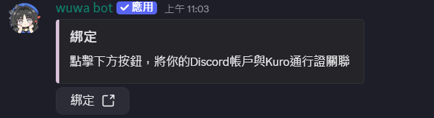
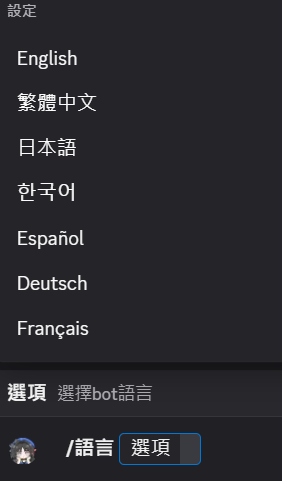
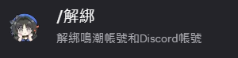
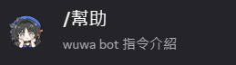

# 账号绑定（Kuro通行证xDiscord官方机器人）

各位漂泊者在使用功能前，请先先完成Wuwabot的綁定，詳情請參考以下官方的教學：

## 帳號綁定

使用Wuwa bot前，請先完成帳號的綁定
您的頻道中使用帳號綁定的指令 /綁定 ，點擊連結前往帳號綁定界面，完成2步登入步驟

①登入KURO GAMES通行證

②登入Discord帳號

完成後，頁面將檢測到您的登入狀態，點擊中間的【帳號連接】，即可成功完成Wuwa Bot帳號綁定。

## 開始使用Wuwa bot

Wuwa bot目前總共有7個指令，在使用上文提到的【/綁定】指令完成帳號綁定後，我們將可以通過其他指令體驗Wuwa bot的各個功能。

/歡迎：歡迎各位漂泊者開始體驗Wuwa bot，可以查看所有的指令與大致的功能說明

/生成：選擇特定角色後，基於你當前所持的該角色的信息生成角色卡片

/語言：

（1）Wuwa bot的系統語言是跟隨Discord的，如果您想切換與bot交互的語言，請到Discord語言設置裡切換

（2）如果您想切換生成的角色圖片的語言，可以使用 /語言 命令來切換目標語言。

/解綁：
如您需要解綁之前關聯的帳號，可以選擇該指令進行解綁

/幫助：
獲取Wuwa bot的使用教程，點擊將跳轉到本使用手冊頁面

<若使用官方机器人有任何问题或BUG，概不属于我方服务范围请洽询官方小编协助处理！！>