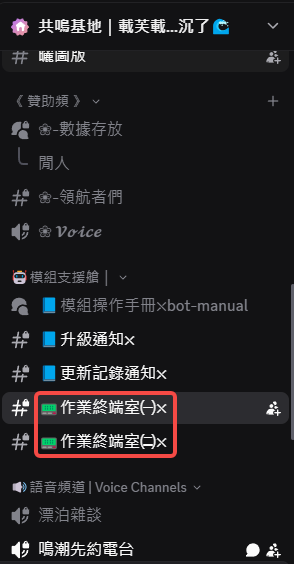
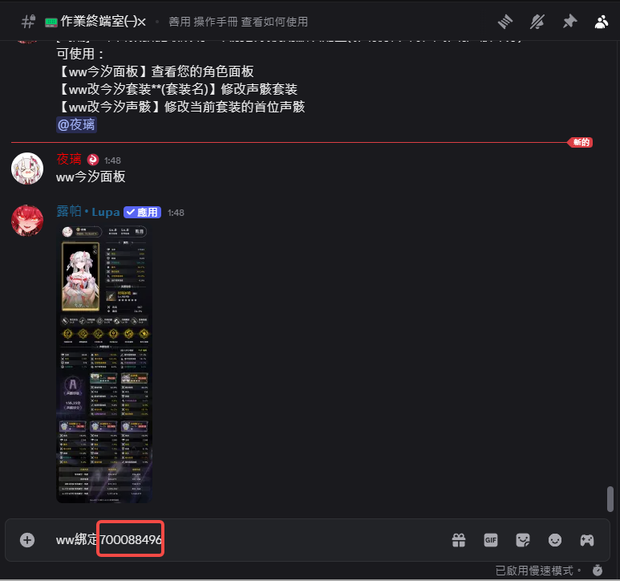
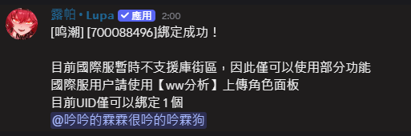
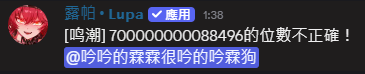
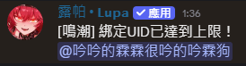

# 绑定UID(绑定我方小助手)
此板由 吟吟的霖霖很吟的吟霖狗 制作

在使用各项指令前务必先绑定UID唷！

::: caution
在绑定前务必务必务必！！确认自身UID，不要绑定到别人的了！！
:::

## 一、选择终端室或自己的频道中

## 二、输入 绑定123456789 
那因为目前机器人有调整，前缀改为 @tag机器人 

## 三、成功绑定
若出现以下者为成功

## 四、绑定的UID位数不正确（非完整）
若出现以下结果请先检查您的UID是否有输入错误！

## 五、绑定已达到限制
目前机器人仅可以绑定1个UID

